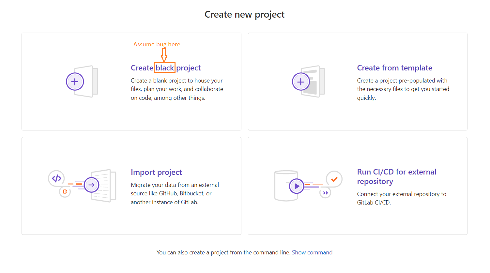

## Summary (Summarize the bug encountered concisely)

Typo in project creation button text: "Create **black** project" is displayed instead of "Create **blank** project" on the new blank project page. The misspelling causes the UI label to be misleading and incorrect.

---

## Steps to reproduce

1. Open browser and navigate to https://gitlab.com/users/sign_in
2. Log in with valid credentials
3. Navigate to https://gitlab.com/projects/new#blank_project
4. Observe the button / heading text for the blank project creation option

---

## What is the current bug behavior?

The button / option label reads **"Create black project"** instead of "Create blank project".  
The word "blank" has been misspelled as "black", likely due to a typo introduced during a recent code change.

---

## What is the expected correct behavior?

The button / option label should read **"Create blank project"**, clearly communicating to the user that a new empty (blank) project will be created.

---

## Relevant logs and/or screenshots

Screenshot of the affected UI element:

**Affected page:** https://gitlab.com/projects/new#blank_project  
**Affected test case:** `Create Blank Project With Valid Name` — PageObject/04_ProjectPage.txt  
**Discovered during:** Positive test execution — step "Select Blank Project Option"

---

## Possible fixes

The fix is a one-character correction in the UI string resource or template file responsible for rendering the blank project option label.  
Search the codebase for the string `"Create black project"` and replace it with `"Create blank project"`.

---

## Whom do you report / Assign To / Tags

      /label ~bug ~reproduced ~needs-investigation
      /cc @project-manager
      /assign @qa-tester

---

## Priority

**Minor**

The application functionality is not broken — users can still create a blank project. However, the incorrect label is misleading and reduces trust in the product quality. It should be corrected before the next public release.
